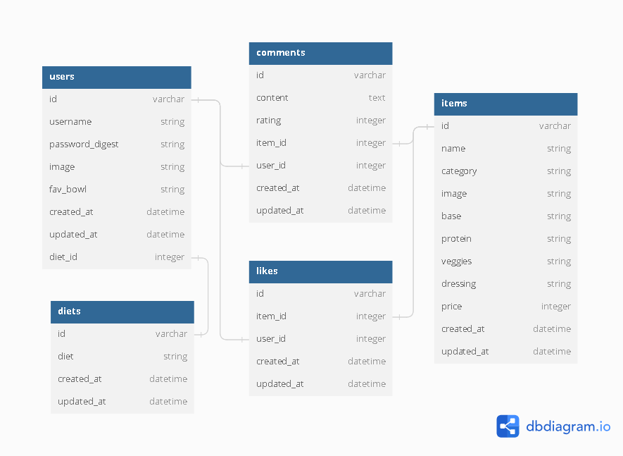

# Backyard Bowls Food Truck Website


As the capstone project for my full stack boot camp at Flatiron School, I wanted to work with an external client. Luckily, my good friend had a food truck called Backyard Bowls. So, I asked him if I could build a mock website around the food truck menu and branding. He was enthusiastic about the idea, so I got started on it.

With this capstone project, there were a few major requirements:
- The **front end** coded using **React**, incorporating **client-side routing** & **user auth**, all the while fetching data from…
- A **back end** consisting of a **custom API** coded using **Ruby on Rails** with full **CRUD (Create-Read-Update-Delete)** and at least one **join-table**
- And lastly, incorporating a **new technology**, which at the time I chose to use **Tailwind CSS** & **Daisy UI**

All of these requirements are fulfilled by the project, and I have added new features to the project since I graduated the boot camp, the most important of which is **unit testing**. This was a very important skill that we weren't actually taught in the boot camp, but is extremely useful in speeding up the development process. I actually wrote an [article about getting started with unit testing in Ruby on Rails](https://dev.to/mikedavissoftware/intro-to-unit-testing-in-ruby-on-rails-lfo-temp-slug-5156114?preview=47ed1db17e48b7b1dda75193cb03477c9df3b85f0abb73789118ac6438fee1f34ae2c8c561d4344f05946bbd82d807c98f50fc4f8ae0e6c9e490f745).

---

### Exploring the Project

Feel free to clone the project and explore it on your local environment.

#### Running the Front End

Open up a terminal and run these commands:

```
cd client
npm install
npm run dev
```

#### Running the Back End

Open up a terminal and run these commands:

```
bundle install
rails s
```

This should start a server at port 3000 by default, and the fetching from the front end should work properly.

---

### Database Diagram:
